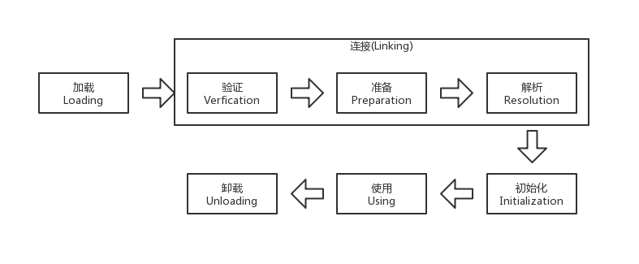

[toc]
# 虚拟机类加载机制
## 类加载时机
类从被加载到虚拟机内存开始，到卸载出内存为止，它的整个生命周期包括：加载、验证、准备、解析、初始化、使用和卸载7个阶段。其中验证、准备、解析3个部分统称连接。


加载、验证、准备、初始化和卸载这5个阶段的顺序是确定的，但是解析阶段不一定：它再某些情况下可以再初始化阶段之后再开始。

## 类加载的过程
### 加载
在加载阶段需要完成3件事：
1. 通过一个类的全限定名来获取定义此类的二进制字节流。
2. 将字节流所代表的静态存储结构转换为方法区的运行时数据结构。
3. 在内存中生成一个代表该类的Class对象，作为方法区这些数据的访问入口。

**一个非数组类的加载阶段(加载阶段中获取类的二进制字节流的动作)是开发人员可控性最强的，因为加载阶段既可以使用系统提供的引导类加载器来完成，也可以由用户自定义的类加载器去完成，可以通过定义自己的类加载器去控制字节流的获取方式(既重写一个类加载器的loadClass()方法)。**

加载阶段和连接阶段的部分内容是交叉进行的，加载阶段尚未结束，连接阶段可能就已经开始了。

###  验证
目的：为了确保Class文件的字节流中包含的信息符合当前虚拟机的有要求，而且不会危害虚拟机自身的安全。
1. 文件格式验证
验证字节流是否符合Class文件格式的规范，并且能被当前版本的虚拟机处理。
例如: 
    - 是否以魔数0xCAFEBABE开头
    - 主次版本号是否在当前虚拟机处理范围之内
    - 常量池的常量中是否由不被支持的常量类型(检查常量tag标志)
    ...
2. 元数据验证
对自己吗描述的信息进行语义分析，以确保其描述的信息符合Java语言规范的要求
    - 这个类是否由父类(除了java.lang.Object之外，所有的类都应当由父类)
    - 这个类的父类是否继承了不允许被继承的类(被final修饰)
    ...
3. 字节码验证
最复杂的一个阶段。通过数据流和控制流分析，确定程序语义是合法的、符合逻辑的
    - 保证任意时刻操作栈的数据类型与指令代码序列都能配合工作
    - 保证跳栈指令不会跳转到方法体以外的字节码指令上
    ...
4. 符号引用验证
发生在虚拟机将符号引用转化为直接引用的时候，符号引用验证可以看作是对类自身意外(常量池中的各种符号引用)的信息进行匹配校验
    - 符号引用中同故宫字符串描述的全限定名是否能找到对应的类
    - 在指定类中是否存在符号方法的字段描述以及简单名称所描述的方法和字段

### 准备
准备阶段是正式为类变量分配内存并设置类变量初始值的阶段，这些变量所使用的内存都将在方法区中进行分配。这个阶段中有两个容易产生混淆的概念需要强调一下：
1. 这时候进行内存分配的仅包括类变量(static修饰的变量),而不包括实例变量，实例变量将会在对象实例化时随着对象一起分配在Java堆中。
2. 这里所说的初始值“通常情况”下是数据类型的零值，假设一个类变量的定义为==public static int value = 123==那变量value在准备阶段过后的初始值为0而不是123，因为这时还未开始执行任何Java方法(赋值动作将在初始化阶段才会之心那个)。“特殊情况”下，如果类字段的字段属性表中存在ConstantValue属性，那么准备阶段变量value会被初始化为ConstatnValue所指定的值。假设上面类变量value的定义为==public static final int value = 123==那么主备阶段value值为123。

基本数据类型的零值
数据类型 | 零值
-- | --
int | 0
long | 0L
short | (short)0
char | '\u0000'
byte | (byte)0
boolean | false
float | 0.0f
double | 0.0d
reference | null

### 解析
解析阶段是虚拟机将常量池内的符号替换为直接引用的过程。解析动作主要针对类或接口、字段、类方法、接口方法、方法类型、方法句柄和调用点限定符7类符号引用进行。

- 符号引用：以一组符号来描述所引用的目标，符号可以是任何形式的字面量，只要使用时能无歧义地定位到目标即可。
- 直接引用：可以是直接指向目标地指针、相对偏移量或是一个能间接定位到目标地句柄。

### 初始化
初始化阶段是类加载过程地最后一步，才是真正开始执行类中定义的Java程序代码(或者说是字节码)
初始化阶段是执行类构造器<clinit>()方法的过程。
- <clinit>()方法是由于编译器自动收集类中的所有类变量的赋值动作和静态语句块(static{})中语句合并产生的，编译器收集的顺序是由语句在源文件中出席那的顺序决定的，静态语句块中只能访问到定义在静态语句块之前的变量，定义在它之后的变量，在前面的静态语句块可以赋值，但是不能访问；
- <clinit>()方法与类的构造函数不同，它不需要显示的调用父类构造器，虚拟机会保证在子类的<clinit>()方法执行之前，父类的<clinit>()方法已经执行完毕。
- 由于父类的<clinit>()方法先执行，也就意味着父类中定义的静态语句块要优先于子类的变量赋值操作。
- <clinit>()方法对于类和接口并不是必需的，如果一个类中没有静态语句块，也就没有对变量的赋值操作，就不会为这个类生成<clinit>()方法。


## 类加载器
- 启动类加载器(Bootstrap ClassLoader): 这个类加载器使用C++语言实现，是虚拟机自身的一部分。负责将存放在<JAVA_HOME> \lib目录中的，或者被-Xbootclasspath擦书所指定的路径中的类库加载到虚拟机内存中。
- 扩展类加载器(Extension ClassLoader): 负责加载<JAVA_HOME>/lib/ext目录中的，或者被java.ext.dirs系统变量指定的路径中的所有类库。
- 应用程序类加载器(Application ClassLoader): 负责加载用户类路径(ClassPath)上指定的类库

## 双亲委派模型
### 介绍
双亲委派模型要求除了顶层的启动类加载器外，其余的类加载器都应当有自己的父类加载器。一般使用组合(Copmposition)关系来服用父类加载的代码。

### 工作过程
如果一个类加载器收到了类加载的请求，它首先不会自己尝试加载这个类，而是把这个请求委派给父类加载器去完成，因此所有的加载请求最终都应该传到顶层的启动类加载器中，只有当父类加载器反馈自己无法完成加载请求时，子加载器才会尝试自己去加载。

### 源码分析
双亲委派模型对于保证Java程序的稳定运作很重要，但它的实现却非常简单，源代码都集中在java.lang.ClassLoader的loadClass()方法中，逻辑清晰易懂：先检查是否已经被加载过，若没有加载则调用父加载器的loadClass方法，若父加载器为空则默认使用启动类加载作为父加载器。如果父类加载失败，抛出ClassNotFoundException异常后，在调用自己的findzClass()方法进行加载
```java
 protected Class<?> loadClass(String name, boolean resolve)
        throws ClassNotFoundException
    {
        synchronized (getClassLoadingLock(name)) {
            // First, check if the class has already been loaded
            Class<?> c = findLoadedClass(name);
            if (c == null) {
                long t0 = System.nanoTime();
                try {
                    if (parent != null) {
                        c = parent.loadClass(name, false);
                    } else {
                        c = findBootstrapClassOrNull(name);
                    }
                } catch (ClassNotFoundException e) {
                    // ClassNotFoundException thrown if class not found
                    // from the non-null parent class loader
                }

                if (c == null) {
                    // If still not found, then invoke findClass in order
                    // to find the class.
                    long t1 = System.nanoTime();
                    c = findClass(name);

                    // this is the defining class loader; record the stats
                    sun.misc.PerfCounter.getParentDelegationTime().addTime(t1 - t0);
                    sun.misc.PerfCounter.getFindClassTime().addElapsedTimeFrom(t1);
                    sun.misc.PerfCounter.getFindClasses().increment();
                }
            }
            if (resolve) {
                resolveClass(c);
            }
            return c;
        }
    }
```