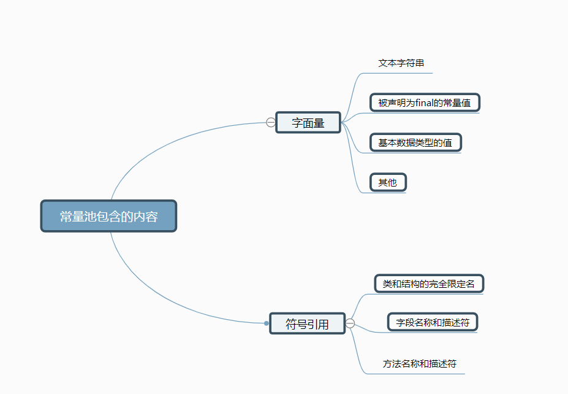
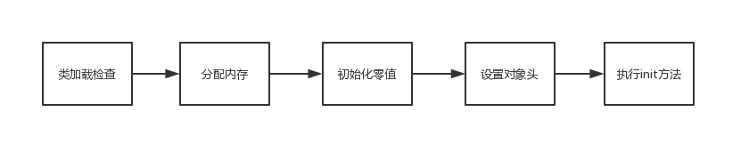
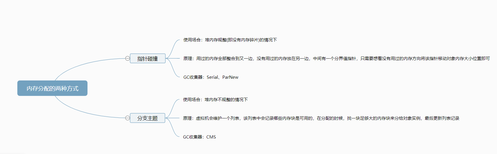

[toc]

#Java 内存区域

## 一 概述
对于Java程序员来说，在虚拟机自动内存管理机制的帮助下，不在需要为每一个new操作去写配对的delete/free代码，不容易出现内存泄漏和内存溢出的问题。不过正是因为将内存的控制权力交给了java虚拟机，一旦出现内存的泄露和溢出方面的问题，如果不了解虚拟机是怎么使用内存的，那么排查错误将会成为一项异常艰难的工作。

## 二 运行时数据区域
Java虚拟机在执行Java程序的过程中会把它所管理的内存划分为若干个不同的数据区域。

JDK 1.8:


### 线程私有的
- 程序计数器
- 虚拟机栈
- 本地方法栈
### 线程共享的
- 堆
- 方法区
- 直接内存(非要运行时数据区的一部分)
### 2.1程序计数器
程序计数器(Program Counter Register)是一块较小的内存空间，它可以看作是当线程所执行的字节码的行号指示器。**字节码解释器工作时就是通过改变这个计数器的值来选取下一条需要执行的字节码指令，分支、循环、跳转、异常处理、线程恢复等基础功能都需要依赖这个计数器来完成。**

为了线程切换后能恢复到正确的执行位置，每条线程都需要一个独立的程序计数器，各条线程之间计数器互不影响，独立存储，我们称这类内存区域为“线程私有”的内存。

> 程序计数器是唯一一个在Java虚拟机规范中没有规定任何OutOfMemoryErroy情况的区域。

### 2.2 Java虚拟机栈
Java虚拟机栈也是线程私有的，它的生命周期与线程相同。描述的是Java方法执行的内存模型：每个方法在执行的同时都会创建一个栈帧(Stack Frame)用于存储局部变量表、操作数栈、动态链接、方法出口等信息。
> 每一个方法从调用直至执行完成的过程，就对应着一个栈帧在虚拟机栈中入栈到出栈的过程。

Java内存可以粗糙的区分为堆内存(Heap)和栈内存(Stack)，其中栈就是现在说的虚拟机栈，或者说是虚拟机栈中局部变量表部分。
> 实际上，Java虚拟机栈是由一个个栈帧组成，每个栈帧中都拥有：局部变量、操作数栈、动态链接、方法出口信息

局部变量表存放了编译器可知的各种基本数据类型(boolean、byte、char、short、int、float、long、double)、对象引用(reference类型，它不等同于对象本身，可能是一个指向对象起始地址的引用指针，也可能是指向一个代表对象的句柄或其他与此对象相关的位置)和returnAddress类型(指向了一条字节码指令的地址)

Java虚拟机栈规定了两种异常情况：StackOverFlowError和OutOfMemoryError
- StackOverFlowError：如果下称请求的栈深度大于虚拟机所允许的深度，则抛出此异常。
- OutOfMemoryError：如果虚拟机栈可以动态扩展，并且扩展时无法申请到足够的内存，就会抛出磁异常。
### 2.3 本地方法栈
本地方法栈与虚拟机栈所发挥的作用非常相似，区别是:
- 虚拟机栈为虚拟机执行Java方法(也就是字节码 )服务
- 本地方法栈则为虚拟机使用到的Native方法服务。

> 在Sun  HotSpot虚拟机中把本地方法栈和虚拟机栈合二为一。

本地方法被执行的时候，在本地方法栈也会创建一个栈帧，用于存放该本地方法的局部变量表、操作数栈、动态链接、出口信息。

与虚拟机栈中一样，本地方法栈区域也会抛出StackOverFlowError和OutOfMemoryError两种异常。

### 2.4 Java 堆
Java堆(Java Heap)是Java虚拟机所管理的内存中最大的一块。Java堆是被所有线程共享的一块内存区域，在虚拟机启动时创建。**此内存区域的唯一目的就是存放对象实例，几乎所有的对象实例都在这里分配内存。**

Java堆时垃圾收集器管理的主要区域，因此很多时候被称为**GC堆。**从内存回收的角度看，由于现在收集器基本都采用**分代收集算法**，所以Java堆中还可以细分为：**新生代和老生代**；再细致一点的有：Eden空间、From Survivor空间、To Survivor空间等。**进一步划分的目的是为了更好地回收内存，或者更快的分配内存**

### 2.5 方法区
共享的内存区域，用于存储已被虚拟机加载的类信息、常量、静态变量、即时编译器后的代码等数据。虽然Java虚拟机规范把方法区描述为堆的一逻辑部分，但是它有个别名**Non—Heap(非堆)**，目的应该时与Java堆区分开来。

**在JDK1.8的时候，方法区被彻底移除了，取而代之是元空间，元空间使用的是之际内存。**
常用参数
```
-XX:MetaspaceSIze=N  //设置Metaspace的初始(和最小)大小
-XX:MaxMetaspaceSize=N  //设置Metaspace的最大大小
```
#### 2.5.1 为什么要将永久代(PerGen)替换元空间(MetaSpace)呢？
整个永久代有一个JVM本身设置固定大小上限，无法进行调整，而元空间使用的是直接内存，受本机可用内存呢的限制，并且永远不会得到Java.lang.OutOfMemoryError。你可以使用 -XX：MaxMetaspaceSize 标志设置最大元空间大小，默认值为unlimited，这意味着它只受系统内存的限制， -XX:MetaspaceSize 调整标志定义元空间的初始大小如果未指定此标志，则Metaspace将根据运行时的应用程序需求动态地重新调整大小。

### 2.6 运行时常量
运行时常量池是方法区的一部分，Class文件中除了有类的版本、字段、方法、接口等描述信息外，还有常量池信息(用于存放编译器生成的各种字面量和符号引用)

**JDK 1.7及以后版本的JVM已经将运行是常量池从方法区移了出来，在Java中开辟了一块区域存放运行时常量。

### 2.7 直接内存
**直接内存并不是虚拟机运行时数据区的一部分，也不是Java虚拟机规范中定义的内存区域。但是这部分内存也被频繁的使用**

JDK 1.4 中新加入了NIO(New Input/Output)类，引入了一种基于通道(Channel)与缓冲区(Buffer)的I/O方式，它可以使用Native函数直接分配堆外内存，然后通过一个存储在Java堆中DirectByteBuffer对象作为这块内存的引用进行操作。这样能在一些场景中显著提高性能，因为避免了Java堆和Native堆中来回复制数据。

本机直接内存的分配不会受到Java堆的限制，但是，既然是内存就会受到本机总内存大小以及处理器寻找空间的限制

## 3. HotSpot 虚拟机对象探秘
通过上面的介绍我们大概知道了虚拟机的内存情况，下面我们来详细的了解下HtoSpot虚拟机在Java堆中对象的分配、布局和访问的全过程。


### 3.1 对象的创建
下面便是Java 对象创建过程。


#### Step1：类加载检查
虚拟机遇到一条new指令时，首先将去检查这个指令的参数是否能在常量池中定位到一个类的符号引用，并且检查这个符号引用代表的类是否已被加载、解析和初始化过。如果没有，那必须限制性想要赢得类加载过程。
#### Stept2：分配内存
在**类加载检查**通过后，虚拟机将为新生对象**分配内存**。对象所需内存的大小在类加载完成后便可确定，为对象分配空间的任务等同于把一块确定大小的内存从Java堆中划分出来。**分配方式**有“**指针碰撞**”和“**空闲列表**”两种，**选择那种分配方式由Java堆是否规整决定，而Java堆是否规整右由所曹勇的垃圾收集器是否带有压缩整理功能决定。**

##### 内存分配的两种方式：
选择以上两种分配方式由Java堆是否规整决定，而Java堆内存是否规整，取决于GC收集器的算法是"标记-清除"，还是"标记-整理"(也称作"标记-压缩"),值得注意的是，复制算法内存也规整的


##### 内存分配并发问题：
在创建对象的时候有一个很重要的问题，就是线程安全，因为在时机开发过程中，创建对象是很频繁的事情，作为虚拟机来说，必须要保证线程是安全的，通常来讲，虚拟机采用两种方式保证线程安全：
- CAS + 失败重试：CAS是乐观锁的一种实现方式。所谓乐观锁就是，每次不加锁二十假设没有冲突而去完成某项操作，如果因为冲突失败就重试，知道成功为止。**虚拟机采用CAS配上失败重试的方式保证更新操作的原子性。**
- TLAB：为每一个线程预先在Eden区分配一块内存，JVN在给线程中的对象分配内存时，首先在TLAB分配，当对象大于TLAB中的剩余内存或TLAB的内存已用尽时，再采用上述的CAS进行内存分配。

#### Step3：初始化零值
内存分配完成后，虚拟机需要要将分配到的内存空间都初始化为零值(不包括对象头)。这一步操作保证了对象的实例字段在Java代码中可以不赋初始值就直接使用，程序能访问到这些字段的数据类型所对应的零值。

#### Step4：设置对象头
接下来，虚拟机要对对象进行必要的设置，例如这个对象是哪个类的实例，如何才能找到类的元数据、对象的哈希码、对象的GC分代年龄等信息。**这些信息存放在对象头中**。根据虚拟机当前运行状态的不同，如是否启用偏向锁等，对象头会有不用的设置方式。

#### Step:执行init方法
在上面工作都完成之后，从虚拟机的视角来看，一个新的对象已经产生了，但从Java程序的视角来看，对象创建 才刚刚开始——<init>方法还没有执行，所有的字段都还为零。所以一般来说，执行new指令之后会接着执行<init>方法，把对象按照程序员的意愿进行初始化，这样一个真正可以用的对象才算完全产生出来。

### 3.2 对象的内存布局
在HotSpot虚拟机中，对下个在内存中存储的布局可以分为3块**对象头(Header)、实例数据(Instance Data)和对齐填充(Padding)**

HotSpot虚拟机中的对象头包括两部分信息：
- 用于存储对象自身的的运行时数据(如哈希码、GC分代年龄、锁状态标志、线程持有的锁、偏向线程ID、偏向时间戳等)。
- 类型指针，即对象指向它的类元数据的指针，虚拟机通过这个指针来确定这个对象是哪个类的实例。

**实例数据部分是对象真正存储的有效信息**，也是在程序中所定义的各种类型的字段内容。

**对其填充部分不是必然存在的，也没有什么特别的意义，仅仅起占位作用**。因为HotSpot虚拟机的自动内存管理系统要求对象起始地址必须是8字节的倍数,因此，当对象实例数据部分没有对齐时，就需要通过对齐填充来补全。

### 3.3 对象的访问定位
建立对象就是为了使用对象，我么的Java程序通过栈上的reference的数据来操作堆上的具体对象.对象的访问方式有虚拟机实现而定，目前主流的访问方式有**使用句柄**和**直接指针**两种：
1. 句柄：如果使用句柄的话，那么Java堆中将会划分出一块内存来作为句柄池，reference中存储的就是对象的句柄地址，而句柄中包含了对象实例数据与类型数据各自的具体地址信息。


2. 直接指针：如果使用直接针织访问，那么Java堆对象的布局中就必须考虑如果放置访问类型数据的相关信息，而reference中存储的直接就是对象的地址，


**这两种对象访问方式各有优势，使用句柄来访问的最大好处就是reference中存储的是稳定的句柄地址，在对象被移动(垃圾收集时移动对象是非常普遍的行为)时只会改变句柄中的实例数据指针，而reference本身不需要修改。使用直接指针访问方式的最大好处就是速度快，它节省了一次指针定位的时间开销。**

