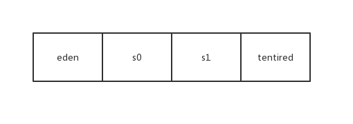

# 垃圾收集器与内存分配策略
[toc]

## 概述
人们早期就在思考GC需要完成的3件事情：
- 哪些内存需要回收？
- 什么时候回收？
- 如何回收？

> 当我们需要排查各种内存溢出、内存泄漏问题时、当垃圾收集成为系统达到更高并发量的瓶颈时，，我们就需要对这些“自动化”的技术实施必要的监控和调节。

### 1. JVM内存分配与回收
Java的自动你内存管理主要时针对对象内存的回收和对象内存的分配。同时，Java内存管理最核心的功能时**堆**内存中对象的分配与回收。

Java堆是垃圾回收器管理的主要区域，因此也被称为**GC堆**。从垃圾回收的角度，由于现在收集器基本采用分代垃圾收集算法，所以Java 堆海口可以细分为：新生代和老年代；再细致一点有：Eden空间、From Surivior、To Survior空间等。**进一步划分的目的是更好地回收内存，或者更快地分配内存**。

#### 堆空间的基本结构

- 新生代：eden区、s0(From)区、s1(To)
- 老年代: tentired区

大部分情况，对象都会首先再eden区域分配，在一次新生代垃圾回收后，如果对象还存活，则会进入s1,并且对象的年龄还会加1(eden区->Surrvior区后对象的初始年龄变为1)，当它的年龄增加到一定程度(默认15),就会被晋升到老年代中。对象晋升到老年代的年龄阈值，可以通过参数 ==-XX:MaxTenuringThreshold== 来设置。经过这次GC后，eden区和“From”区已经被清空。这个时候“From”和“To”会交换他们的角色，就是新的“To”就是上次GC前的“From”，新的“From”就是上次GC前的“To”。不管怎样，都会保证名为To的Survivor区域是空的。Minor FC会一直重复这样的过程，直到"To"区被填满之后，会将所有对象移动到老年代中。

#### 堆内存常见分配策略
- 对象优先在eden区分配
- 大对象直接进入老年代
- 长期存活的对象将进入老年代

##### 对象优先在eden区分配
目前主流的垃圾回收器都会采用分代回收算法，因此需要将堆内存分为新生代和老年代，这样我们就可以根据各个年代的特点选择合适的垃圾收集算法。

**Minor GC和Full GC的区别**
- 新生代 GC(Minor GC): 指发生新生代的垃圾回收收集动作，Minor GC非常频繁，回收速度一般也比较快。
- 老年代 GC(Major GC/Full GC)：指发生在老年代的GC，出现了Major GC经常会伴随至少一次的Minor GC(并非绝对),Major GC的速度一般会比Minor GC的慢10倍以上。

###### 测试
```java

public class GCTest {

	public static void main(String[] args) {
		byte[] allocation1, allocation2;
		allocation1 = new byte[30900*1024];
		//allocation2 = new byte[900*1024];
	}
}
```
通过一下方式运行：


添加参数：==-XX:+PrintGCDetails==


运行结果：


从上图我们剋看出eden区内存几乎已经被分配完全(即使程序什么也不做，新生代也会使用20000多k内存)。假如我们再为allocation2分配内存会出现什么情况呢？


**解释一下为什么会出现这种情况**：因为给allcation2分配内存的时候eden区内存几乎被分配完了，我们刚刚讲了eden区没有足够空间进行分配时，虚拟机将放弃一次Minor GC。GC 期间虚拟机又发现allocation1无法存入Survior空间，所以只好通过**分配担保机制**把新生代的对象提前转移到老年代中去，老年代上的空间足够存放allocation1，所以不会出现Full GC。执行Minor GC后，后面分配的对象如果能狗仔eden区的话，还是会在eden区分配内存。
> 空间分配担保
> 在发生Minor GC之前，虚拟机会先检查老年代最大可用连续空间是否大于新生代所有对象总空间，如果这个条件成立，那么Minor GC 可以确保是安全地。

##### 大对象直接进入老年代
所谓大对象是指需要大量连续内存空间的Java对象，如数组、字符串。
这样做的目的是避免在Eden区及两个Survivor区之间发生大量的内存复制(新生代采用复制算法收集内存)而降低效率。

##### 长期存活的对象将进入老年代
既然虚拟机才有用了分代收集的思想来管理内存，那么内存回收时就必须能识别那些对象应放在新生代，哪些对象应放在老年代。为了做到这点，虚拟机给每个对象定义了一个对象年龄(Age)计数器。

如果对象在Eden出生并经过第一次Minor GC 后仍然存活，并且能被Survivor容纳的话，将被移动Survivor空间中，并将对象年龄设为1。对象在Survivor区没每熬过一次Minor GC ，年龄就增加一岁，当它的年龄增加到一定程度(默认15岁)，就会将被晋身到老年代中。对象晋升老年代的年龄阈值，可以通过参数==-XX:MaxTenuringThreshold== 设置

##### 动态对象年龄判定 
为了能更好的使用不同程序的内存状态，虚拟机并不是永远地要求年龄必须达到MaxTenuringThreshold才能晋升为老年代，如果在Survivor空间相同年龄所有对象地总和大于Survivor空间地一半，年龄大于或等于该年龄地对象就可以直接进入老年代，无需等到要求年龄。

#### 对象已死吗？
堆中几乎存放着所有对象地实例，对垃圾回收前地第一步就是要判断哪些对象已经死亡(即不能再被任何途径使用地对象)

##### 引用计数法
给对昂中添加一个引用计数器，每当有一个地方引用它时，计数器值就加1；当引用失效时，计数器值就减1；任何时刻计数器为0的对象就是不可能再被使用的。

**这个算法实现简单，判定效率高，在大部分情况下他都是一个不错的算法。但是目前主流的虚拟机并没有选择这个算法来管理内存，其最主要的原因时它很难解决对象之间相互循环引用的问题。**
>举个例子:对象objA和objB都有字段instance，赋值令objA.instance = objB及objB.instance = objA,除此之外，这两个对象再无任何的引用，实际上这两个对象已经不可能在被访问，但是他们也因为互相引用着对方，导致它们的引用计数都不为0，于是引用计数算法无法通知GC收集器回收它们。

```java
public class ReferenceCountingGC{
    public Object instance = null;
  
    public static void testGC(){
        ReferenceCountingGC ogjA = new ReferenceCountingGC();
        ReferenceCountingGC ogjB = new ReferenceCountingGC();
        objA.instance = objB;
        objB.instance = objA;

        objA = null;
        objB = null;
    }
}
```
##### 可达性分析算法
这个算法的基本思路就是通过一系列称为“GC Roots”的对象作为起始点，从这些节点开始向下搜索，搜索所走过的路径称为引用链，当一个对象到GC Roots没有任何引用链时，则证明对象不可用。


##### 再谈引用
无论是通过引用计数算法判断对象的引用数量，还是通过可达性分析算法判断对象的引用链是否可达，判定对象是否存活都与“引用”有关。JDK1.2以后，Java对引用概念呢进行了扩充，将引用分为**强引用、软引用、弱引用、虚引用**(引用强度逐渐减弱)

###### 强引用(Strong Reference)
指在程序代码中普遍存在的，类似“Object obj = new Object()”这类的引用，只要强引用还存在，垃圾收集器永远不会回收掉被引用的对象。

###### 软引用(Soft Reference)
软引用是用来描述一些还有用但并非必须的对象。对于软引用关联着的对象，在系统将要发生内存溢出异常之前，将会把这些对象列进回收范围之内进行二次回收。如果这次回收还没有足够的内存，才会抛出内存溢出异常。

##### 弱引用(Weak Reference)
弱引用也是用来描述非必须对象的，但是它的强度比软引用更弱一些，被弱引用关联的对象只能生存到下一次垃圾收集发生之前。当垃圾收集器工作时，无论当前内存是否足够，都会回收掉只被弱引用关联对象。

##### 虚引用
虚引用是最弱的一种引用关系。一个对象是否有虚引用的存在，完全不会对其生存周期构成影响，也无法通过虚引用来取得一个对象实例。唯一个对象设置虚引用关联的唯一目的就是能在这个对象被收集器回收时收到一个系统通知。

> 在程序设计中一般很少使用弱引用和虚引用，使用软引用的情况较多，这是因为**软引用可以加速JVM对垃圾内存的回收速度，可以维护系统的运行安全，放置内存溢出等问题的产生。**

#### 生存还是死亡
即使在可达性分析算法中不可达的对象，也并非是“非死不可”，这时候他们暂时处于“缓刑”阶段，要真正宣告一个对象死亡，**至少要经历两次标记过程**：如果对象在进行可达分析后发现没有与GC Roots 相连接的引用链，那它将会被第一次标记且进行一次筛选，筛选条件是此对此对象是否有必要执行finalize()方法。当对象没有覆盖finalize()方法，或者finalize()方法已经被虚拟机调用过，虚拟机将这两种情况都是为“没有必要执行”。

被判定为需要执行的对象将会放置在一个叫做F-Queue的队列中进行第二次标记，除非这个对象与引用链上的任何一个对象建立关联，否则就会被真的回收。

### 垃圾收集算法
- 标记-清除算法
- 复制算法
- 标记算法
- 分代收集算法

#### 标记-清除算法
该算法分为“标记”和“清除”两个阶段：首先标记出所有需要回收的对象，在标记完成后统一回收所有被标记的对象。它是最基础的收集算法，后续的收集算法都是基于这种思路并对其不足进行改进而得到的。它主要不足有两个：
1. 效率问题：标记和清除两个过程的效率都不高
2. 空间问题：标记清除后会产生大量不连续的内存碎片。


#### 复制算法
为了解决效率问题,“复制”收集算法出现了，它将可用内存按照容量划分为大小相等的两块，每次使用其中的一块。当这一块的内存用完了，就将还存活着的对象复制到另一块上面，然后再把已经使用过的内存空间一次清理掉。这样使得每次都是对整个半区进行内存回收。


目前主流的商业虚拟机都采用这种收集算法来回收新生代。将内存分为一块较大的Eden空间和两块较小的Survivor空间，每次使用Eden和其中一块Survivor。当回收时，将Eden和Survivor中还存活着的对象要一次性地复制到另一块Survivor空间上，最后清理掉Eden和刚才用过的地Survivor空间 (HotSpot虚拟机默认Eden和Survivor地大小比例是8：1);


#### 标记-整理算法
根据老年代地特点推出地一种标记算法，标记过程仍然与“标记-清除”算法一样，但后续步骤不是直接对可回收对象进行清理，而是让所有存活的对象都向一端移动，然后直接清理掉端边界以为的内存。


#### 分代收集算法
当前商业虚拟机的垃圾收集都采用“分代收集。这种算法没有什么新的思想，只是根据对象存活周期将内存分为几块。一般将Java堆分为新生代和老年代，这样我们就可以根据各个年代的特点采用最适当的收集算法了。**在新生代中，每次垃圾收集时都发现那个有大批量对象死去，只有少量存活，那就用复制算法，只需要付出少量存活对象的复制成本就可以完成收集。而老年代，因为对象存活率高、没有额外空间对它进行分配担保，就必须使用“标记-清理”或者“标记-整理"算法来进行回收。**

#### 垃圾收集器
如果说收集算法是内存回收的方法论，那么垃圾收集器就是内存回收的具体实。

##### Serial 收集器
Serial(串行)收集器是最基本、历史最悠久的垃圾收集器。是一个**单线程**收集器。它的单线程意义不仅仅以为着它只会使用一条垃圾收集线程完成垃圾收集工作，更重要的是它在进行垃圾收集器工作的时候必须暂停其他所有的工作线程(“Stop The World”)，直到它收集结束。

**新生代采用复制算法，老年代采用标记-整理算法**


##### ParNew 收集器
ParNew收集器其实就是Servial收集器的多线程版本，除了使用多线程进行垃圾收集外，其余行为(控制参数、收集算法、huishoucelue)和Serial收集器完全一样。

**新生代采用复制算法，老年代采用标记-整理算法**


它是许多运行在Server模式下的虚拟机的首要选择，除了Serial收集器外，只有他能与CMS收集器(真正意义上的并发收集器)配合工作。

##### Parallel Scavenge收集器
Parallel Scavenge 收集器也是四好用复制算法的多线程收集器，它看上去几乎和ParNew都以一样。那它有什么特别之处呢？

Parallel Scavenge 收集器 关注点是吞吐量(高效率的利用给CPU).CMS等收集器的关注点是尽可能缩短垃圾收集时用户线程的停顿时间(提升用户体验)。
> 所谓吞吐量就是CPU用于运行用户代码的时间与CPU总消耗时间的比值。

Parallel Scavenge 收集器提供了两个参数用于精确控制吞吐量

1. -XX:MaxGCPauseMillis 
    控制最大垃圾收集停顿时间
2. -XX:GCTimeRatio
    直接设置吞吐量大小

##### Serial Old 收集器
Serial 收集器的老年代版本，它同样是一个单线程收集器。使用标记-整理算法。这个收集器的主要意义也是在于Client模式下的虚拟机使用。

##### Parallel Old 收集器
Parallel Scavenge 收集器的老年代版本。使用多线程和标记整理算法。在注重吞吐量以及CPU资源敏感的场合，都可以优先考虑Parallel Scavenge和parallel Old 收集器。

##### CMS 收集器
CMS收集器是一种获取最短回收停顿时间为目标的收集器。基于标记-清除算法实现，它的运作过程相对于前面几种收集器来说更复杂一些，分为4个步骤：
- 初始标记：仅仅之际标记一下GC Roots能直接关联到的对象，速度很快；
- 并发标记：进行GC Roots Tracing的过程。
- 重新标记：为了修正并发标记期间因用户程序继续运作而导致标记产生变动的那一部分对象的标记记录。
- 并发清除：开启用户线程，同时GC 线程开始对为标记的区域进行清扫。


CMS收集器主要优点：并发收集、低停顿。但是它有一下3个明显的缺点：
- 对CPU 资源非常敏感；
- 无法处理浮动垃圾；
- 使用标记-清除算法 导致收集结束时会有大量空间碎片产生。

##### G1 收集器
G1 是一款面向服务器的垃圾收集器，主要针对配备多颗处理器及大容量内存的机器，以及高概率满足GC停顿时间要求的同时，还具备高吞吐量性能特征。它具备以下特点：
- 并行与并发：G1能充分利用多CPU、多核环境下的硬件优势，使用多个CPU(或者CPU核心)来缩短Stop-The-World停顿的时间，
- 分代收集：分代概念在G1收集器中得以保留，虽然G1可以不需要其他收集器配合就能独立管理整个GC堆。
- 空间整合：与CMS的标记-情理算法不同，G1从整体来看是基于标记整理算法实现的收集器，从局部来看是基于复制算法实现的。
- 可预测的停顿：这是G1相对与CMS的另一个大优势，降低停顿时间G1和CMS共同的关注点，但G1除了追求停顿外，还能建立可预测的停顿时间模型，能让使用者明确指定一个长度为M毫秒的时间段内。

G1收集器的运作分为一下一个步骤
- 初始标记
- 并发标记
- 最终标记
- 筛选回收

G1收集器在后台维护了一个优先列表，每次根据允许的收集时间，优先选择回收价值最大的Region。这种使用Region划分内存空间以及有有优先级的区域回收方式，保证了GF收集器在有限时间内可以尽可能高的手机效率(把内存化整为零)。

参考：《深入理解java虚拟机 第2版》
      JavaGuide：https://github.com/Snailclimb/JavaGuide/blob/master/docs/java/jvm/