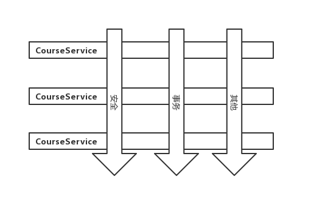
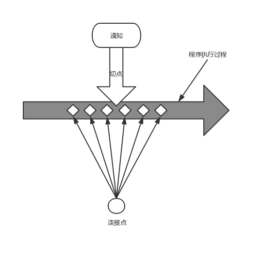

[toc]

# 面向切面编程
在软件开发中，散布于应用中多处的功能被称为横切关注点(cross-cutting concern)。通常来说，这些横切关注点从概念上是与应用的业务逻辑相分离的(但是往往会直接嵌入到应用的业务逻辑中)。把这些横切关注点与业务逻辑相分离正是面向切面编程(AOP)所要解决的问题。

# 1.1 什么是面向切面编程
  
横切关注点可以被模块为特殊的类，这些被称为切面(aspect)。这样做有两个好处：
1. 现在每个关注点都集中于一个地方，而不是分散到多处代码中。
2. 服务模块更简洁，因为只包含主要关注点(或核心功能)的代码，而次要关注点的代码被转移到切面中了。
## 1.1.1 定义AOP术语
描述切面的常用术语有通知(advice)、切点(pointcut)和连接点(joinpoint)。下图展示了这些概念是如何管理在一起的。    
  

### 通知(advice)
- 前置通知(Before): 在目标方法被调用前调用通知功能。
- 后置通知(After): 在目标方法完成之后调用通知，此时不会关心方法的输出是什么。
- 返回通知(After-returning): 在目标方法成功执行后调用通知。
- 异常通知(After-throwing): 在目标方法抛出异常后调用通知。
- 环绕通知(Around)：通知包裹了被通知的方法，在被通知的方法调用之前和调用之后执行自定义的行为。

### 连接点(Join point)
我们的应用可能有数以千计的时机应用通知。这些时机被称为连接点。连接点是在应用实行过程中能够插入切面的一个点。这个点可以是调用方法时、抛出异常时、甚至修改一个字段时。切面代码可以利用这些点插入到与应用的正常了流程之中，并添加新的行为。

### 切点(Pointcut)
如果说通知定义领了切面的“什么”和“何时”的话，那么切点就定义了“何处”。切点的定义会匹配通知所要织入的一个或多个连接点。
> 我们通常使用明确的类和方法名称，或是利用正则表达式定义所匹配的类和方法名称来指定这些切点。有些AOP框架允许我们创建动态的切点，可以根据运行时的决策(比如方法的参数)来决定是否应用通知。

### 切面(Aspect)
切面时通知和切点的结合。通知和切点共同定义了切面的全部内容——它是什么，在何时和何处完成其功能。

### 引入(Introduction)
引入允许我们向现有的类添加新方法或属性。

### 织入(Weaving)  
织入时把切面应用到目标对象并创建新的代理对象的过程。切面在指定的连接点被织入到目标对象中。在目标对象的生命周期里有多个点可以进行织入： 
- 编译期：切面在目标类编译时被织入。这种方式需要特殊的编译器，AspectJ的织入编译器就是以这种方式织入切面的。
- 类加载期：切面在目标类加载到JVM时候被织入。这种方式需要特殊的类加载器(ClassLoader)，它可以在目标类被引入应用之前增强该目标类的字节码。
- 运行期：切面在应用运行的某个时刻被织入。一般情况下，在织入切面时，AOP容器会为目标对象动态地创建一个代理对象。SpringAOP就是以这种方式织入切面的。

> 通知包含了需要用于多个应用对象的横切行为；连接点时程序执行过程中能够应用通知的所有点；切点定义了通知被应用的具体位置(在哪些连接点)。

## 1.1.2 Spring 对AOP的支持
Spring提供了4种类型的AOP支持：
- 基于代理的经典Spring AOP
- 纯POJO切面
- @AspectJ注解驱动的切面
- 注入式AspectJ切面(适用于Spring各版本)  
前三种都是Spring AOP实现的变体，Spring AOP构建在动态代理基础之上，因此，Spring对AOP的支持局限于方法拦截。
