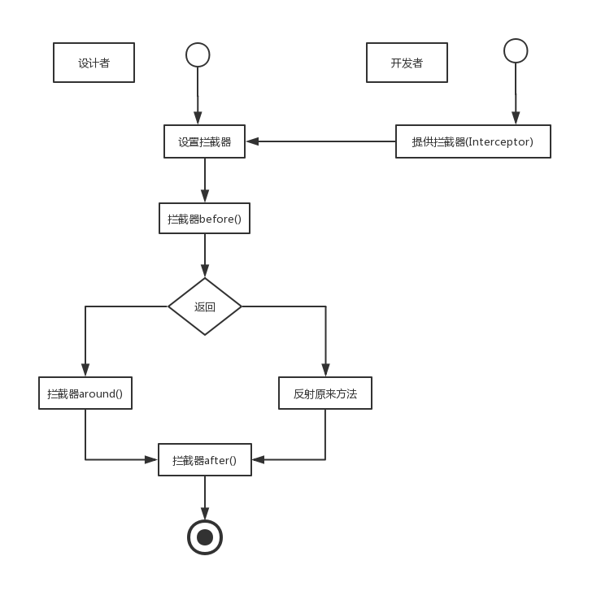

# 拦截器

由于动态代理一般比较难理解，程序设计者会设计一个拦截器接口供开发者使用，开发者只需要要知道拦截器接口的方法、含义和作用即可，无需知道动态代理是怎么实现的。先定义一个拦截器接口  Interceptor。
```java
public interface Interceptor {

    /**
     * 
     * @param proxy 代理对象
     * @param target    真实对象
     * @param method    方法
     * @param args  运行方法参数
     * @return
     */
    public boolean before(Object proxy, Object target, Method method, Object[] args);

    public void around(Object proxy, Object target, Method method, Object[] args);

    public void after(Object proxy, Object target, Method method, Object[] args);

}
```
这里定义了三个方法，before、around、after
- before方法返回boolean值，它在真实对象前调用。当返回true时，则反射真实对象的方法，当返回false时，则调用around方法。
- 在before方法返回为false的情况下，调用around方法。
- 在反射真实对象方法或者around方法执行之后，则调用after方法。

实现这个Interceptor 的实现类————MyInterceptor。

```java
public class MyInterceptor implements Interceptor {

    @Override
    public boolean before(Object proxy, Object target, Method method, Object[] args) {
        System.out.println("反射方法之前逻辑");
        return false; //不反射被大力对象原有方法
    }

    @Override
    public void around(Object proxy, Object target, Method method, Object[] args) {
        System.out.println("反射方法后逻辑");
    }

    @Override
    public void after(Object proxy, Object target, Method method, Object[] args) {
        System.out.println("取代了被代理对象的方法");
    }

}

```
他实现了所有的Interceptor接口方法，使用JDK动态代理，就可以去实现这些方法在适当时调用逻辑了。 在JDK动态代理中使用拦截器，如下所示
```java
public class InterceptorJdkProxy implements InvocationHandler {

    private Object target; // 真实对象

    private String interceptorClass = null; // 拦截器全限定名


    public InterceptorJdkProxy(Object target, String interceptorClass) {
        this.target = target;
        this.interceptorClass = interceptorClass;
    }

    /**
     * 绑定委托对象并返回一个【代理占位】
     * 
     * @param target  真实对象
     * @param interceptorClass  拦截器全限定名
     * @return  代理对象【占位】
     */
    public static Object bind(Object target, String interceptorClass) {

        // 取得代理对象
        return Proxy.newProxyInstance(target.getClass().getClassLoader(), target.getClass().getInterfaces(),
                new InterceptorJdkProxy(target, interceptorClass));
    }

    @Override
    public Object invoke(Object proxy, Method method, Object[] args) throws Throwable {
       if (interceptorClass == null) {
           //没有设置拦截器直接反射原有方法
           return method.invoke(target, args);
       } 
       Object result = null;
       //通过反射生成拦截器
       Interceptor interceptor = (Interceptor) Class.forName(interceptorClass).newInstance();
       //设置前置方法
       if (interceptor.before(proxy, target, method, args)) {
           result = method.invoke(target, args);
       }else{
           interceptor.around(proxy, target, method, args);
       }
       //调用后置方法
       interceptor.after(proxy, target, method, args);
       return result;
    }
}
```
这里有两个属性，一个是target，他是真实对象；另一个是字符串interceptorClass，它是一个拦截器的全限定名。下面是执行步骤
1. 在bind方法中使用JDK动态代理绑定一个了对象，然后返回代理对象。
2. 如果没有设置拦截器，则直接反射真实对象的方法，然后结束，否则进入第3步。
3. 通过反射生成拦截器，并准备使用它。
4. 调用拦截器的before方法，如果返回true，反射原来的方法；否则运行拦截器的around方法。
5. 调用拦截器的after方法。
6. 返回结果。

拦截器的工作流程

- 开发者只要知道拦截器的作用就可以编写拦截器了，编写完后可以设置拦截器，这样就完成了任务，所以对于开发者而言相对简单了。
- 设计者可能是精通Java的开发人员，他来完成动态代理的逻辑
- 设计者只会把拦截器的接口暴露给开发者使用，让动态代理的逻辑在开发者的视野中“消失”  
拦截器可以进一步简化动态代理的使用方法，使程序变得更简单

测试方法
```java
public class InterceptorMain {

    public static void main(String[] args) {
        HelloWorld proxy = (HelloWorld) InterceptorJdkProxy.bind(new HelloWorldImpl(), "interceptor.MyInterceptor");
        proxy.sayHelloWorld();
    }
}
```
输出结果：
```

反射方法之前逻辑
取代了被代理对象的方法
反射方法后逻辑

```
