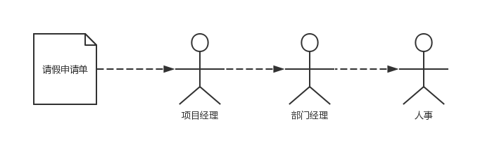
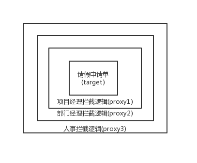

# 责任链模式
举个例子，一个程序员需要请假一周。如果把请假申请单看成一个对象，那么它需要经过项目经理、部门经理、人事等多个角色的审批，每个角色都有机会通过拦截这个申请单进行审批或者修改。这个时候就要考虑提供项目经理、部门经理、和人事的处理逻辑，所以需要提供3个拦截器，而传递的则是请假申请单。
如图所示：

当一个对象在一条链上被多个拦截器处理(拦截器也可以选择不拦截处理他)时，我们把这样的设计模式称为==责任链模式==，它用于一个对象在多个角色中传递的场景。还是上面的例子，申请单走到项目经理那，经理可能把申请时间“一周”改为“5天”，从而影响了后面的审批，后面的审批都要根据前面的结果进行。这个时候可以考虑用层层代理来实现，就是当申请单走到项目经理处，使用第一个动态代理proxy1，当它走到部门经理处，部门经理会得到一个在项目经理的代理proxy1基础上生成的proxy2来处理部门经理的逻辑。依此类推即可。

